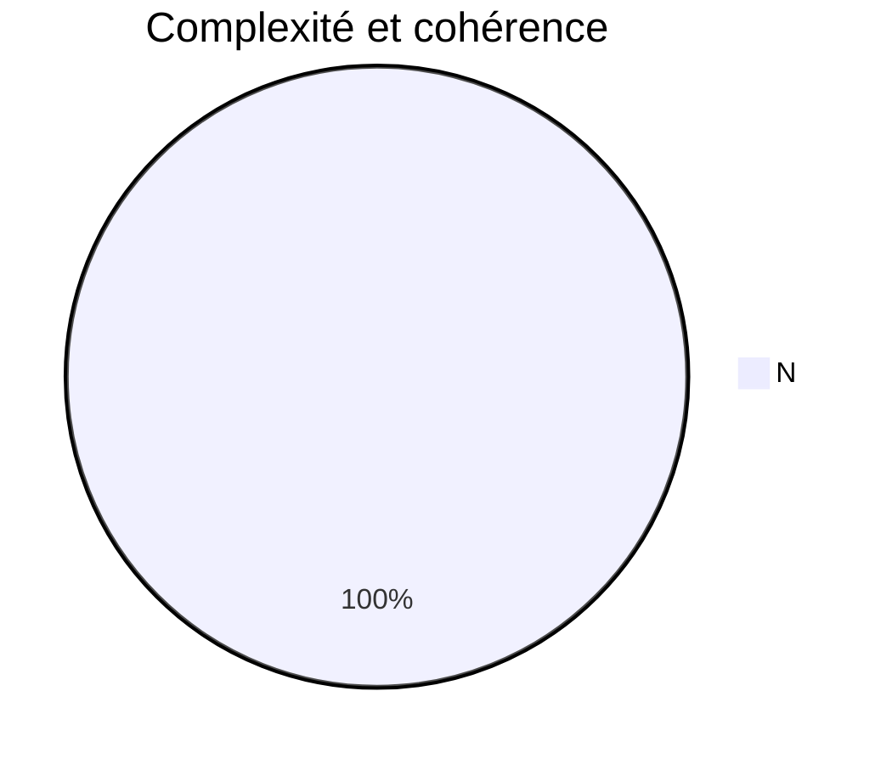

# Good Practises : 

The **good practises** are a set of standards which, when adhered to, can greatly help the development, maintenance, modification, optimization and understanding of code in general.
 
 
*Here is a list of good practices that you can follow when developing a project in a team or alone:*

## Summary : 

 - [General Good Practices](https://github.com/TheHerbin/DevOps-GoodPractises#general-good-practices)
 - Node JS
 - React JS

## General Good Practices:

**Indent:**

 - *Having good indentation will make it much easier for other developers
   to understand your code..*.
   
     ```javascript
    function anExampleFunction() {
        let x;
        if(true){
            x = true;
        }else{
            x = false;
        }
        return x;
    }

    ```
   
**Respect of syntax conventions :**


 - *Respecting conventions such as camelCase or SnakeCase can be very
   beneficial to a project, it makes it easier to distinguish functions
   from classes and variables and therefore makes it easier to read the
   code.*

**Comment your code :**

 - *As simple as it may seem, commenting on your code can be very useful
   and can have several uses: it can be used to describe what a function
   does, the parameters it receives or returns, or to share its doubts
   or add different indications like what to add to this location.*

**Make backups :**

 - *Performing frequent backups, whether locally or online (git / github)
   allows you to recover pieces of code that you may have lost or to
   return to a previous state of the project.*

**Keep code simple :**

 - *A simple and concise code facilitates the reading of the code and
   makes it possible to have a less cumbersome program.*

**Portability :**

 - *Do not use too much of hardcoded text, data or code*

**Code scalability :**

 - *Do not lock your code and always think of how to upgrade or improve
   your code...*

**Modules, API's and code re-usability :**

 - *You can create modules and functions that can be re-used later. This
   way, your code will be optimised because you will have less code
   locally. You can even use the APi's and modules of other people.*

**Carry out daily and weekly “tests” :**

 - *If you want a clean and squared code, dont forget to do daily and
   weekly tests of your application / Software. It can really make you
   gain some time and prevent you from creating bugs and other troubles
   at the end.*
   
   # indicateurs de suivi de la mise en place du DevOps
La complexité de la méthode correspond plus ou moins au nombre **d'essais nécessaires** pour couvrir **tous les cas.** Plus la méthode est complexe, plus elle est difficile à maintenir et à tester.

La couverture de test est le **pourcentage de lignes de code du projet qui ont été appelées** pendant la phase de test. Attention : ce n'est pas parce qu'une ligne est appelée qu'elle est testé.
```mermaid
pie  title Tests unitaires et couverture

"Couverture de test"  : 386
   


